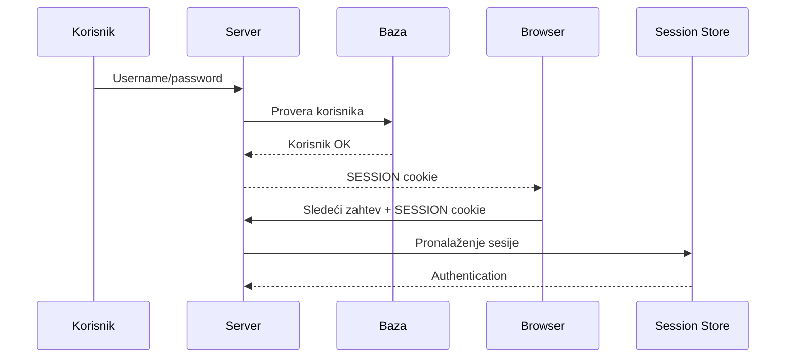
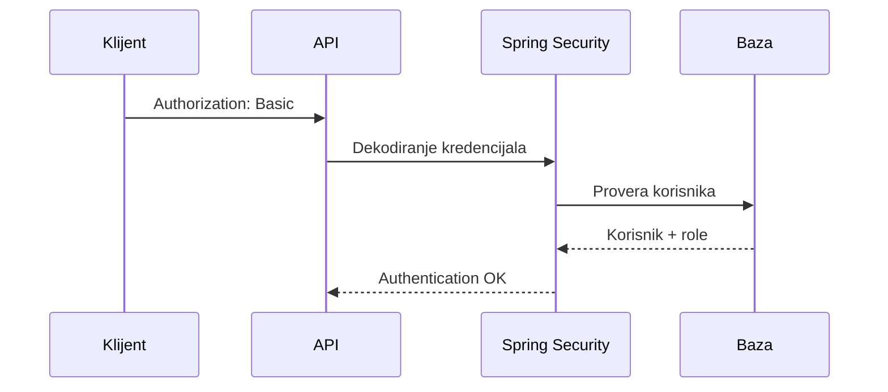
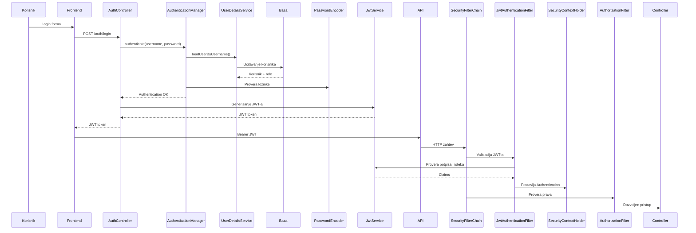
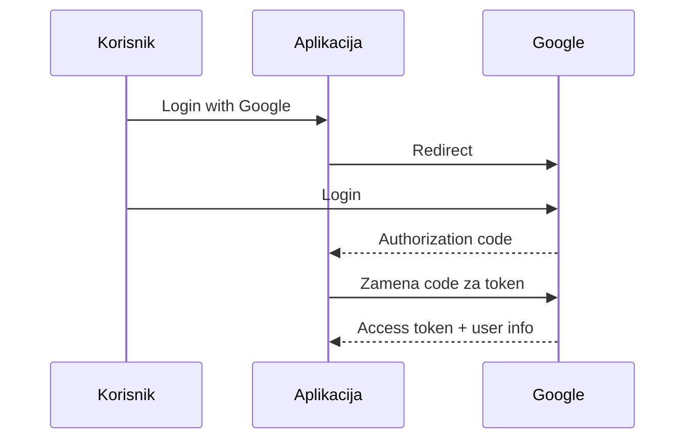
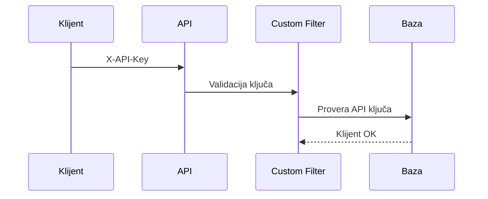

# Autentifikacija i autorizacija u Spring Boot aplikacijama

## Uvod

Bezbednost web aplikacija obično se deli na dva osnovna pojma:

- **Autentifikacija (Authentication)** — utvrđivanje identiteta korisnika
- **Autorizacija (Authorization)** — određivanje šta autentifikovani korisnik sme da radi

Primer:

- korisnik unosi username i password → autentifikacija
- korisnik pokušava da pristupi `/admin` endpoint-u → autorizacija

U Spring Boot aplikacijama za ove zadatke se najčešće koristi Spring Security.

---

# Osnovni pojmovi u Spring Security-u

## Authentication

Objekat koji predstavlja prijavljenog korisnika.

Sadrži:

- username
- role/authorities
- informacije o autentifikaciji
- status autentifikacije

Primer:

```java
Authentication authentication =
    SecurityContextHolder.getContext().getAuthentication();
```

---

## SecurityContext

Kontejner koji čuva trenutno autentifikovanog korisnika.

Najčešće:

```java
SecurityContextHolder.getContext()
```

---

## GrantedAuthority

Predstavlja pravo ili rolu korisnika.

Primer:

```text
ROLE_ADMIN
ROLE_USER
COURSE_WRITE
```

---

## UserDetailsService

Interfejs koji Spring koristi za učitavanje korisnika iz baze.

```java
public interface UserDetailsService {
    UserDetails loadUserByUsername(String username);
}
```

---

## PasswordEncoder

Koristi se za heširanje lozinki.

Najčešće:

```java
@Bean
PasswordEncoder passwordEncoder() {
    return new BCryptPasswordEncoder();
}
```

Nikada ne treba čuvati plain-text lozinke.

---

# Najčešći pristupi autentifikaciji i autorizaciji

---

# 1. Session-Based Authentication

## Ideja

Nakon uspešnog logina server kreira sesiju.

Browser čuva session cookie:

```text
JSESSIONID
```

Pri svakom sledećem zahtevu browser automatski šalje cookie.

---

## Tok rada



---

## Spring Boot implementacija

```java
@Bean
SecurityFilterChain securityFilterChain(HttpSecurity http) throws Exception {
    return http
            .authorizeHttpRequests(auth -> auth
                    .requestMatchers("/admin/**").hasRole("ADMIN")
                    .anyRequest().authenticated()
            )
            .formLogin(Customizer.withDefaults())
            .build();
}
```

---

## Prednosti

- jednostavno
- standardno za server-side aplikacije
- browser automatski šalje cookie

---

## Mane

- server mora da čuva sesije
- lošije za mikroservise
- horizontalno skaliranje je komplikovanije

---

# 2. HTTP Basic Authentication

## Ideja

Browser ili klijent šalje username/password pri svakom zahtevu.

Header:

```text
Authorization: Basic base64(username:password)
```

---

## Tok rada



---

## Spring Boot implementacija

```java
@Bean
SecurityFilterChain securityFilterChain(HttpSecurity http) throws Exception {
    return http
            .httpBasic(Customizer.withDefaults())
            .build();
}
```

---

## Prednosti

- veoma jednostavno
- dobro za interne API-je

---

## Mane

- username/password se šalju pri svakom zahtevu
- nepraktično za moderne frontend aplikacije
- mora HTTPS

---

# 3. JWT Authentication

## Uvod u JWT

JWT znači:

```text
JSON Web Token
```

JWT je stateless pristup autentifikaciji.

Server NE čuva sesiju.

Umesto toga, klijent čuva token i šalje ga pri svakom zahtevu.

---

# Struktura JWT-a

JWT ima tri dela:

```text
HEADER.PAYLOAD.SIGNATURE
```

Primer:

```text
eyJhbGciOiJIUzI1NiJ9
.
eyJzdWIiOiJtYXJrbyIsInJvbGVzIjpbIkFETUlOIl19
.
abc123signature
```

---

## Header

Sadrži algoritam potpisivanja.

Primer:

```json
{
  "alg": "HS256",
  "typ": "JWT"
}
```

---

## Payload

Sadrži podatke o korisniku.

Primer:

```json
{
  "sub": "marko",
  "roles": ["ADMIN"],
  "exp": 1710000000
}
```

---

## Signature

Koristi se za proveru integriteta tokena.

---

# JWT autentifikacija — kompletan tok



---

# Authorization header

JWT se najčešće šalje ovako:

```text
Authorization: Bearer eyJhbGc...
```

---

# Spring Boot JWT implementacija

## Maven dependency

```xml
<dependency>
    <groupId>io.jsonwebtoken</groupId>
    <artifactId>jjwt-api</artifactId>
    <version>0.12.5</version>
</dependency>
```

---

# JwtService

## Generisanje tokena

```java
public String generateToken(UserDetails user) {
    return Jwts.builder()
            .subject(user.getUsername())
            .claim("roles", user.getAuthorities())
            .issuedAt(new Date())
            .expiration(new Date(System.currentTimeMillis() + 86400000))
            .signWith(secretKey)
            .compact();
}
```

---

## Validacija tokena

```java
public String extractUsername(String token) {
    return Jwts.parser()
            .verifyWith(secretKey)
            .build()
            .parseSignedClaims(token)
            .getPayload()
            .getSubject();
}
```

---

# JWT Filter

JWT filter proverava svaki zahtev.

Najčešće:

```java
@Component
@RequiredArgsConstructor
public class JwtAuthenticationFilter extends OncePerRequestFilter
{
    private final JwtService jwtService;
    private final UserDetailsService userDetailsService;

    @Override
    protected void doFilterInternal(
            HttpServletRequest request,
            HttpServletResponse response,
            FilterChain filterChain)
            throws ServletException, IOException
    {
        final String authHeader =
                request.getHeader(HttpHeaders.AUTHORIZATION);

        if (authHeader == null ||
                !authHeader.startsWith("Bearer "))
        {
            filterChain.doFilter(request, response);
            return;
        }

        final String jwt = authHeader.substring(7);

        final String username =
                jwtService.extractUsername(jwt);

        if (username != null &&
                SecurityContextHolder.getContext()
                        .getAuthentication() == null)
        {
            UserDetails user =
                    userDetailsService
                            .loadUserByUsername(username);

            UsernamePasswordAuthenticationToken auth =
                    new UsernamePasswordAuthenticationToken(
                            user,
                            null,
                            user.getAuthorities()
                    );

            SecurityContextHolder.getContext()
                    .setAuthentication(auth);
        }

        filterChain.doFilter(request, response);
    }
}
```

---

# SecurityFilterChain konfiguracija

```java
@Bean
SecurityFilterChain securityFilterChain(HttpSecurity http)
        throws Exception
{
    return http
            .csrf(AbstractHttpConfigurer::disable)

            .sessionManagement(session ->
                    session.sessionCreationPolicy(
                            SessionCreationPolicy.STATELESS
                    )
            )

            .authorizeHttpRequests(auth -> auth
                    .requestMatchers("/auth/**").permitAll()
                    .requestMatchers("/admin/**")
                    .hasRole("ADMIN")
                    .anyRequest()
                    .authenticated()
            )

            .addFilterBefore(
                    jwtAuthenticationFilter,
                    UsernamePasswordAuthenticationFilter.class
            )

            .build();
}
```

---

# Zašto addFilterBefore?

```java
.addFilterBefore(
    jwtAuthenticationFilter,
    UsernamePasswordAuthenticationFilter.class
)
```

To znači:

```text
Pre standardnog Spring login filtera,
izvrši JWT proveru.
```

Ako je JWT validan:

- korisnik se autentifikuje
- SecurityContext dobija Authentication
- ostatak Spring Security-ja smatra korisnika prijavljenim

---

# SessionCreationPolicy.STATELESS

```java
.sessionManagement(session ->
    session.sessionCreationPolicy(
        SessionCreationPolicy.STATELESS
    )
)
```

Znači:

```text
NE koristi HTTP sesije.
```

Server ne pamti korisnike između zahteva.

---

# JWT autorizacija

## Endpoint zaštita

```java
.requestMatchers("/admin/**")
.hasRole("ADMIN")
```

---

## Method-level security

```java
@PreAuthorize("hasRole('ADMIN')")
public void deleteUser(Long id)
{
}
```

---

# Refresh token

JWT access token obično kratko traje:

```text
15 min
30 min
1 h
```

Refresh token traje duže:

```text
7 dana
30 dana
```

Koristi se za izdavanje novog access tokena.

---

# Prednosti JWT-a

- stateless
- odličan za REST API
- dobar za mikroservise
- nema session storage
- frontend lako radi sa tokenima

---

# Mane JWT-a

- logout je komplikovaniji
- token se ne može lako opozvati
- veći security rizik ako token procuri
- treba pažljivo rešiti refresh tokene

---

# Gde se čuva JWT?

## Memory

Najbezbednije za SPA.

---

## localStorage

Jednostavno, ali ranjivo na XSS.

---

## HttpOnly cookie

Često najbolje rešenje.

---

# 4. OAuth2 Login

## Ideja

Korisnik se prijavljuje preko:

- Google
- Microsoft
- GitHub
- Facebook

---

## Tok rada



---

## Spring Boot implementacija

```java
.oauth2Login(Customizer.withDefaults())
```

---

# 5. OAuth2 Resource Server

Koristi se kada aplikacija prihvata JWT od eksternog sistema.

Na primer:

- Keycloak
- Auth0
- Okta
- Azure AD

---

## Konfiguracija

```properties
spring.security.oauth2.resourceserver.jwt.issuer-uri=
https://my-auth-server
```

---

# 6. LDAP / Active Directory

Koristi se u organizacijama.

Autentifikacija ide preko:

- LDAP servera
- Active Directory-ja

---

## Spring Boot implementacija

```java
http
    .ldapAuthentication()
```

---

# 7. API Key Authentication

Klijent šalje:

```text
X-API-Key: abc123
```

---

## Tok rada



---

# 8. SAML2 SSO

Enterprise Single Sign-On.

Koristi se u:

- univerzitetima
- državnim institucijama
- velikim kompanijama

---

# Najčešći izbor danas

## Klasična web aplikacija

```text
Session + Form Login
```

---

## REST API + SPA frontend

```text
JWT
```

---

## Enterprise sistemi

```text
OIDC / OAuth2 / SAML2
```

---

# Preporuka za moderne Spring Boot aplikacije

## Backend REST API

- JWT
- OAuth2 Resource Server
- Keycloak ili Auth0

---

## Frontend

- Svelte
- React
- Angular

---

## Komunikacija

```text
Authorization: Bearer JWT
```

---

# Zaključak

Spring Security pruža veoma fleksibilan sistem za:

- autentifikaciju
- autorizaciju
- filtriranje zahteva
- zaštitu endpoint-a

Najčešći moderni pristup danas je:

```text
Spring Boot REST API
+
JWT/OAuth2
+
SPA frontend
```

Za enterprise sisteme često se koriste:

```text
OIDC
SAML2
LDAP
```

dok su za klasične server-side aplikacije i dalje veoma česte:

```text
HTTP Session
Form Login
```
